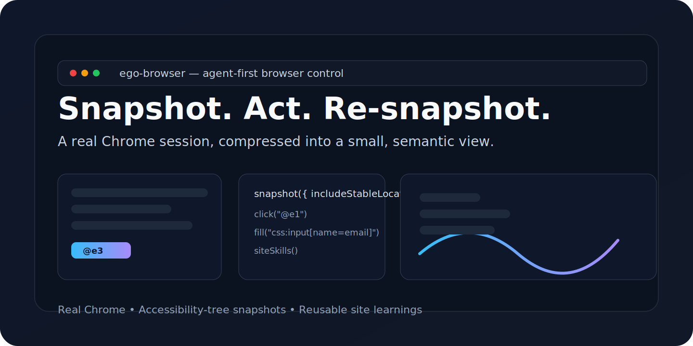

# ego-browser

<div align="center">

[](LICENSE)
[](https://nodejs.org/)
[](https://github.com/CitroLabs/ego-lite/actions/workflows/ci.yml)
[](https://www.npmjs.com/package/ego-browser)




</div>

`ego-browser` is a Node.js browser-automation CLI for AI agents. It connects to a real Chrome session through Chrome DevTools Protocol, compresses the page into a readable accessibility-tree snapshot, and exposes short-lived `@eN` refs so an agent can observe, click, type, capture screenshots, upload files, and call site-specific tools with minimal context.

## What it is

- A CLI that drives your existing Chrome session instead of a separate headless browser.
- A semantic page model based on accessibility-tree snapshots and short-lived refs.
- A reusable site-learning system for repeated flows, selectors, and extraction logic.

## What it is not

- Not a Playwright wrapper.
- Not a framework that asks you to rewrite your automation around a new browser abstraction.
- Not a throwaway script runner; it is built to compound reusable site knowledge over time.

## Who uses it

- AI coding agents that need to log in, fill forms, export reports, and verify UI flows.
- Teams that want repeatable browser automation for internal tools and admin consoles.
- Anyone who has hit token limits trying to feed raw HTML into an agent.

## Quick Start

1. Install and link the CLI:

   ```bash
   cd package/ego-browser
   npm link
   ```

2. Drive Chrome with a copy-paste heredoc:

   ```bash
   ego-browser <<'JS'
   await newTab("https://example.com")
   await waitForLoad()
   print(await pageInfo())
   JS
   ```

3. Read a snapshot, act, and re-snapshot:

   ```bash
   ego-browser <<'JS'
   await newTab("https://example.com")
   await waitForLoad()
   const snap = await snapshot({ includeActionMarks: true, includeStableLocator: true })
   print(snap.content)
   JS
   ```

The browser stays alive across commands, so repeated `ego-browser` calls share one session-backed browser connection.

## Core loop

```bash
ego-browser <<'JS'
await newTab("https://example.com")
await waitForLoad()

print(await siteSkills())
const snap = await snapshot({ includeActionMarks: true, includeStableLocator: true })
print(snap.content)

await click("@e3")
print((await snapshot({ includeActionMarks: true, includeStableLocator: true })).content)
JS
```

Refs like `@e1`, `@e2`, and `@e3` are reassigned on every snapshot. Re-snapshot after any navigation, click, or dynamic re-render. When a target must survive later runs, keep the `loc=...` value from the snapshot row or use a stable CSS or ARIA locator.

## Common helpers

### Navigation and tabs

- `newTab(url = "about:blank")` — open a new tab and switch to it.
- `gotoUrl(url)` — navigate the current tab.
- `pageInfo()` — return URL, title, viewport, and scroll information.
- `listTabs()` / `currentTab()` / `switchTab(target)` — manage tabs.
- `ensureRealTab()` — switch to the first non-`chrome://` / `about:` page.

### Observation and extraction

- `snapshot({ scope, includeActionMarks, includeStableLocator })` — read the accessibility-tree snapshot.
- `captureScreenshot(path?, options?)` — save a screenshot.
- `js(expression)` — evaluate JavaScript in the current page.
- `elementEval(selectorOrRef, fn, ...args)` — run a function against a specific element.
- `elementCenter(selectorOrRef)` — return an element’s center point.
- `cdp(method, params?, sessionId?)` — send a raw CDP request.

### Input and interaction

- `click(target)` / `doubleClick(target)` / `hover(target)`.
- `scroll(x, y)` / `dragMouse(points, options?)`.
- `pressKey(key, modifiers?)` / `typeText(text)`.
- `type(selectorOrRef, text, options?)` / `fill(selectorOrRef, value)` / `fillInput(selector, text, options?)`.
- `uploadFile(selector, path)`.

### Waiting and network

- `wait(seconds)`.
- `waitForLoad({ timeout })`.
- `waitForElement(selector, { timeout, visible })`.
- `waitForNetworkIdle({ timeout, idleMs })`.
- `httpGet(url, options?)`.

### Site learnings

- `siteSkills(url?)` — list learnings that match the current site.
- `runSiteTool(siteId, toolName, args?)` — run a Node-side site tool.
- `runSiteBrowserTool(siteId, toolName, args?)` — run a browser-side site tool in the current page.

## Site learning system

`skills/ego-browser/learnings/` stores reusable site experience. Each learning package can contain:

- `manifest.json` — site metadata, domain matching, and tool declarations.
- Markdown notes — reliable entry points, page structure, and caveats.
- `tools/*.js` — Node-side tools.
- `browser-tools/*.js` — browser-context tools.

Before working a site, check whether it already has a learning:

```bash
ego-browser <<'JS'
await newTab("https://example.com")
await waitForLoad()
print(await siteSkills())
JS
```

You can also check domain coverage with:

```bash
cd package/ego-browser
node scripts/check-domain-learned.js example.com
```

When maintaining learnings, read `skills/ego-browser/references/site-skills-maintenance.zh.md` and run this before submitting changes:

```bash
cd package/ego-browser
npm run validate:site-skills
```

## Development

Run from `package/ego-browser/`:

```bash
npm test
npm run validate:site-skills
```

Core files:

- `package/ego-browser/bin/ego-browser.js` — CLI entrypoint.
- `package/ego-browser/src/run.js` — reads JavaScript from stdin and injects helpers.
- `package/ego-browser/src/browser-runtime.js` — CDP connection, session caching, event buffering, and invalidation.
- `package/ego-browser/src/helpers.js` — exported helper surface.
- `package/ego-browser/src/element-resolver.js` — resolves `@eN`, CSS, XPath, and ARIA/role targets.
- `package/ego-browser/src/site-skills.js` — discovers and runs site learnings.

## Design principles

- Connect to the real browser instead of launching an isolated headless browser.
- Prefer accessibility-tree snapshots and stable locators over brittle coordinates.
- Treat snapshot refs as short-lived and re-observe after any page change.
- Keep public helpers camelCase only.
- Keep site learnings verifiable and maintainable; do not store secrets or rely on pixel coordinates.

## License

MIT © 2026 CitroLabs
