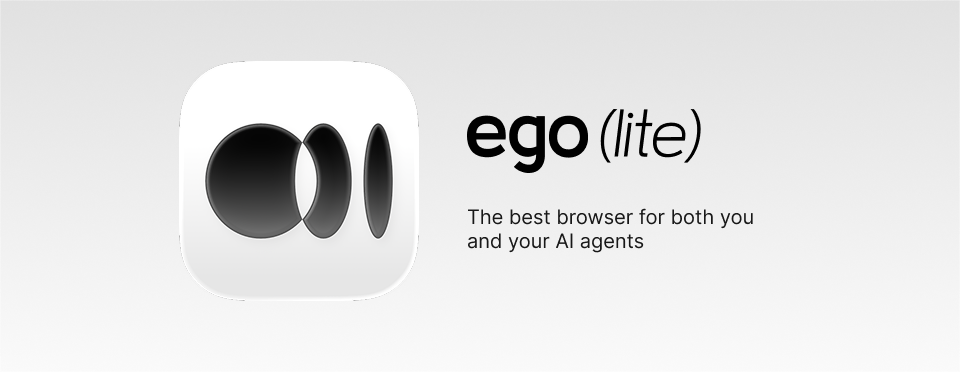

<div align="center">



# ego lite / ego-browser

让 AI Agent 在独立浏览空间中复用用户登录状态，完成真实网页自动化任务。

[产品文档](https://lite.ego.app/document/) · [官方网站](https://lite.ego.app/) · [Discord](https://discord.gg/5eGZVvHbTq) · [License](LICENSE)

</div>

## 项目解决什么问题

常见浏览器自动化方案通常需要单独启动浏览器、重新登录，或者让 Agent 与用户争用同一组标签页。ego lite 将“用户日常浏览”和“Agent 自动化”放在同一个 Chromium 浏览器内，通过相互隔离的 **Task Space** 让双方并行工作：

- Agent 可以继承用户选择迁移到 ego lite 的登录状态、Cookie、扩展和书签；
- 每个 Agent 任务使用独立的标签页集合，不操作用户正在使用的标签页；
- 用户可以看到 Agent 的执行过程，并在登录、验证码等环节接管页面；
- Agent 通过 JavaScript Helper API 组合导航、观察、点击、输入、截图和数据提取操作。

> [!IMPORTANT]
> 本仓库包含开源的 `ego-browser` Node.js 辅助运行时、Agent Skill、站点经验包和测试代码，**不包含 ego lite 浏览器本体**。真实浏览器操作依赖 ego lite 应用提供的 `globalThis.ego` 运行时。仅克隆仓库并执行 `npm install`，不能启动完整的 ego lite 浏览器。

## 主要功能

| 功能 | 项目中的真实实现 |
|---|---|
| 隔离任务空间 | `taskSpaces` 提供创建、复用、切换、认领、交接、接管和关闭 Task Space 的能力。 |
| 标签页与导航 | `browser` 管理标签页；`page.goto()`、`page.reload()` 等方法负责页面导航。 |
| 页面观察 | `page.snapshot()` 输出适合模型读取的语义快照；`page.snapshotRaw()` 返回原始内容和 refs；`page.screenshot()` 保存截图。 |
| 元素交互 | Playwright 风格的 `page.locator()`、`page.getByRole()`、`page.getByText()` 等定位器支持点击、输入、选择、检查、拖动和等待。 |
| 键盘与鼠标 | `page.keyboard` 和 `page.mouse` 提供真实键盘、鼠标、滚轮与拖动操作。 |
| 文件与下载 | Locator 支持 `setInputFiles()`；`page.waitForEvent("download")` 可等待下载。 |
| 页面脚本与 CDP | `page.evaluate()` 执行页面表达式，`cdp()` 访问底层 Chrome DevTools Protocol。 |
| 网络访问 | `fetch.server()` 从 Node.js 侧请求，`fetch.browser()` 从当前浏览器页面上下文请求。 |
| 站点经验包 | `site` 从 `skills/ego-browser/learnings/` 发现、校验并运行可复用的站点工具。 |
| 运行时帮助 | `help()` 从公开 Helper 的 JSDoc 生成用法说明。 |

## 运行要求

### 使用 ego lite

- macOS；仓库内自动安装脚本目前只支持 macOS；
- Apple Silicon（arm64）或 Intel（x64）；
- 首次启动后完成图形界面中的 onboarding；
- 一个能够调用 Agent Skill/终端命令的 AI Agent，例如 Codex、Claude Code 或 Cursor。

### 开发本仓库

- Node.js 22 或更高版本；
- npm；
- macOS 上已安装 ego lite，才能运行依赖真实浏览器的 E2E 测试。

## 安装方法

根据用途选择一种方式。普通用户安装 ego lite 应用；仅参与运行时开发时再克隆源码。

### 方法一：使用仓库内脚本安装 ego lite（macOS）

克隆仓库后，在仓库根目录执行：

```bash
sh skills/ego-browser/scripts/install.sh
```

脚本会根据 CPU 架构下载 DMG，将 `ego lite.app` 安装到 `/Applications`；普通权限安装失败时会尝试通过 `sudo` 完成安装，然后移除 quarantine 属性并启动应用。若 `/Applications` 或 `~/Applications` 中已经存在包含可执行 `ego-browser` 的应用，脚本会直接启动它。

首次启动后，请在应用中完成 onboarding。需要复用既有登录状态时，可按界面提示迁移 Chrome 或其他浏览器的数据。onboarding 会注册 `ego-browser` 命令，通常位于 `~/.local/bin`。

验证命令是否可用：

```bash
command -v ego-browser
```

如果找不到命令，先把常见安装目录加入当前终端的 `PATH`：

```bash
export PATH="$HOME/.local/bin:$PATH"
command -v ego-browser
```

最后执行最小运行时检查：

```bash
ego-browser nodejs <<'EOF'
console.log('ego-browser ready')
EOF
```

输出 `ego-browser ready` 表示命令桥接已就绪。

### 方法二：只安装 Agent Skill

```bash
npx skills add citrolabs/ego-lite
```

这条命令只安装 `ego-browser` Skill，不等于安装浏览器应用。Agent 第一次执行浏览器任务时仍需要安装 ego lite 并完成 onboarding。

### 方法三：从源码构建辅助运行时

```bash
git clone https://github.com/citrolabs/ego-lite.git
cd ego-lite/package/ego-browser
npm ci
npm run build
```

构建结果位于：

```text
package/ego-browser/dist/out/index.js
```

该文件是 ESM 单文件 Helper bundle。直接从源码调用时，程序从标准输入读取 JavaScript：

```bash
node dist/out/index.js <<'EOF'
console.log(await page.info())
EOF
```

此调用仍需要宿主提供 `globalThis.ego`；离开 ego lite 运行时，涉及真实标签页、CDP 或 Task Space 的操作会失败。它主要用于构建、单元测试和运行时调试，不是独立浏览器。

## 使用方法

### 1. 让 Agent 使用 Skill

在支持 Skill 的 Agent 中调用 `ego-browser`，然后用自然语言描述任务，例如：

```text
使用 ego-browser 打开 https://example.com，读取页面标题和正文，并把结果返回给我。
```

Agent 会读取 `skills/ego-browser/SKILL.md`，在独立 Task Space 中生成并执行 JavaScript。

### 2. 直接使用 `ego-browser` 命令

安装版命令接受 `nodejs` 子命令和 heredoc。Helper 已预加载，不需要 `import`：

```bash
ego-browser nodejs <<'EOF'
const task = await taskSpaces.useOrCreate('inspect-example')

await browser.openOrReuseTab('https://example.com', {
  wait: true,
  timeout: 20_000,
})

const info = await page.info()
const snapshot = await page.snapshot({ scope: 'full_page' })

console.log(JSON.stringify({
  taskSpaceId: task.id,
  url: info.url,
  title: info.title,
}, null, 2))
console.log(snapshot)
EOF
```

每次 heredoc 都是一个新的短生命周期 Node.js 进程；跨轮执行时应保存并复用 `task.id` 或任务名称。

任务确认完成后，在一个单独的最终 heredoc 中关闭 Task Space：

```bash
ego-browser nodejs <<'EOF'
console.log(await taskSpaces.complete('inspect-example', { keep: false }))
EOF
```

将 `keep` 设为 `true` 会把页面保留给用户查看；设为 `false` 会关闭 Task Space。

### 3. 常见操作

```bash
ego-browser nodejs <<'EOF'
await taskSpaces.useOrCreate('observe-demo')
await browser.openOrReuseTab('https://example.com', { wait: true })

// 语义快照：返回带 ref/稳定定位信息的页面文本。
const snapshot = await page.snapshot()
console.log(snapshot)

// Playwright 风格定位器。
const heading = await page
  .getByRole('heading', { name: 'Example Domain' })
  .innerText()

// 截图方法返回写入后的绝对路径。
const screenshotPath = await page.screenshot({ fullPage: true })
console.log(JSON.stringify({ heading, screenshotPath }, null, 2))
EOF
```

可用帮助：

```bash
ego-browser nodejs <<'EOF'
console.log(help())
console.log(help('page'))
console.log(help('browser.openOrReuseTab'))
EOF
```

其他诊断命令：

```bash
ego-browser --help
ego-browser --doctor
ego-browser --reload
```

> [!NOTE]
> 安装到 ego lite 中的命令使用 `ego-browser nodejs <<'EOF'`。本仓库构建出的 `dist/out/index.js` 则直接从 stdin 读取脚本，不接受 `nodejs` 子命令。

## 输入输出示例

### 示例一：提取页面结构化数据

输入：

```bash
ego-browser nodejs <<'EOF'
await taskSpaces.useOrCreate('extract-example')
await browser.openOrReuseTab('https://example.com', { wait: true })

const result = await page.evaluate(String.raw`(() => ({
  heading: document.querySelector('h1')?.textContent?.trim() || null,
  links: [...document.querySelectorAll('a')].map((a) => ({
    text: a.textContent?.trim() || '',
    href: a.href,
  })),
}))()`)

console.log(JSON.stringify(result, null, 2))
EOF
```

代表性输出：

```json
{
  "heading": "Example Domain",
  "links": [
    {
      "text": "More information...",
      "href": "https://iana.org/domains/example"
    }
  ]
}
```

网站内容发生变化时，输出也会相应变化。

### 示例二：查看页面信息

输入：

```bash
ego-browser nodejs <<'EOF'
await taskSpaces.useOrCreate('page-info-example')
await browser.openOrReuseTab('https://example.com', { wait: true })
console.log(JSON.stringify(await page.info(), null, 2))
EOF
```

代表性输出：

```json
{
  "url": "https://example.com/",
  "title": "Example Domain",
  "w": 1440,
  "h": 900,
  "sx": 0,
  "sy": 0,
  "pw": 1440,
  "ph": 900
}
```

其中视口和页面尺寸会随设备、窗口大小和页面内容变化。如果页面存在原生 JavaScript 对话框，`page.info()` 会返回对话框信息，需先通过 CDP 处理对话框。

## Task Space 与用户接管

- `taskSpaces.useOrCreate(nameOrId)`：复用 Agent 拥有的空间，或按名称创建新空间；
- `taskSpaces.handOff(nameOrId)`：登录、验证码等环节把控制权交给用户；
- 用户明确完成操作后，使用 `taskSpaces.takeOver(nameOrId)` 重新获得控制；
- `taskSpaces.complete(nameOrId, { keep })`：完成任务并保留或关闭空间；
- Agent 不会自动认领用户拥有的空间；需要用户授权后调用 `taskSpaces.claim(nameOrId)`。

当浏览器返回“user is controlling”时，Agent 应停止操作并等待用户明确同意，不应循环重试或擅自接管。

## 项目结构

```text
.
├── package/ego-browser/          # TypeScript Helper 运行时与测试
│   ├── src/                      # CLI、CDP、定位器、驱动和 Task Space 实现
│   ├── scripts/                  # 构建、校验和真实浏览器 E2E
│   └── package.json
├── skills/ego-browser/           # Agent Skill
│   ├── SKILL.md                  # Agent 使用协议
│   ├── references/install.md     # 安装与排障流程
│   ├── scripts/install.sh        # macOS 安装脚本
│   └── learnings/                # 站点经验包
├── spec/                         # Skill 规范
├── docs/                         # README 图片资源
└── .codex-plugin/                # Codex 插件清单
```

运行时数据流：

```text
stdin JavaScript
  → runMain()
  → helperContext() 注入 page/browser/taskSpaces/site/fetch/cdp
  → globalThis.ego / CDP
  → ego lite 中的标签页与 Task Space
  → console.log 输出
```

## 开发与测试

在 `package/ego-browser/` 目录执行：

```bash
npm ci
npm run build
npm run typecheck
npm test
```

其他命令：

```bash
npm run validate:site-skills   # 校验 skills/ego-browser/learnings
npm run e2e                    # 运行依赖 ego lite 的真实浏览器 E2E
npm run mutation-check
npm run validate:agent-style
```

`npm test` 会先构建，再执行 TypeScript 类型检查和 Node.js 内置测试套件。项目使用 ESM，公开 Helper 的说明来自 JSDoc；新增公开 Helper 时需要同步更新 Skill 文档和测试。

## 已知限制

- 仓库内自动安装脚本目前仅支持 macOS；
- 真实网页控制必须通过 ego lite 应用提供的运行时；
- 每个 heredoc 进程结束后不会保留 JavaScript 内存状态，应通过 Task Space、标签页或外部文件延续任务；
- `@N` ref 来自最近一次语义快照，页面重新渲染后可能失效；跨步骤优先使用快照提供的稳定 `loc=...` 或明确 CSS 定位器；
- 网站可能要求验证码或人工确认，此时需要用户接管；
- 本仓库采用 MIT License，ego lite 浏览器应用是单独提供的免费下载产品。

## 更多文档

- [Agent 使用协议](skills/ego-browser/SKILL.md)
- [安装与排障](skills/ego-browser/references/install.md)
- [运行时开发说明](package/ego-browser/README.md)
- [贡献指南](CONTRIBUTING.md)
- [在线文档](https://lite.ego.app/document/)

## License

本仓库代码采用 [MIT License](LICENSE)。
