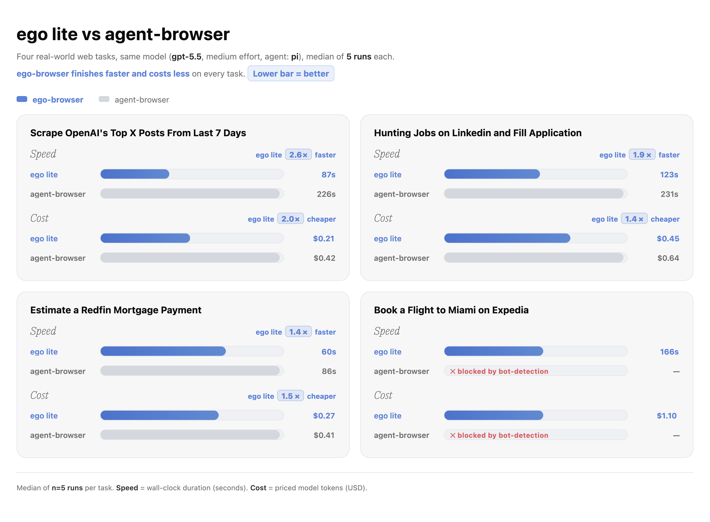

<div align="center">


**Самый быстрый браузер для browser automation AI-агентов**

<a href="https://trendshift.io/repositories/42334?utm_source=repository-badge&amp;utm_medium=badge&amp;utm_campaign=badge-repository-42334" target="_blank" rel="noopener noreferrer"></a>

<p>
  <a href="README.md">English</a> ·
  <a href="README.ru.md"><strong>Русский</strong></a>
</p>

<p>
  <a href="https://cdn.ego.app/setup/macos/arm64/egolite-Y7MbxKIuhzFB.dmg"></a>
  <a href="https://cdn.ego.app/setup/macos/x64/egolite-Y7MbxKIuhzFB.dmg"></a>
  <a href="https://discord.gg/5eGZVvHbTq"></a>
  <a href="https://x.com/ego_agent"></a>
  <a href="https://lite.ego.app/document/"></a>
  <a href="LICENSE"></a>
</p>

</div>

ego (lite) — браузер, в котором вы и AI-агенты работаете параллельно. Агенты выполняют browser-задачи в своих Spaces, ваши вкладки остаются вашими, а задачи закрываются быстрее и на меньшем числе токенов.

Существующие инструменты вроде browser-use и agent-browser — это framework’и automation: им нужен отдельный браузер, логины редко переносятся чисто, и вы с агентом боретесь за одни и те же вкладки. ego lite — один браузер, изначально спроектированный, чтобы вы делили его вдвоём. Без лишней настройки агент всегда достаёт до ваших реальных логинов и вкладок через `ego-browser`.

## Демо

https://github.com/user-attachments/assets/ffe7954b-58ee-411e-b35d-ec30c58a08bc

## Быстрый старт

Сегодня ego lite работает на macOS. Windows и Linux — в [roadmap](https://lite.ego.app/roadmap).

### 1. Установка

Выберите удобный путь.

**1.1 Скачать macOS app**

<a href="https://cdn.ego.app/setup/macos/arm64/egolite-Y7MbxKIuhzFB.dmg"></a>
<a href="https://cdn.ego.app/setup/macos/x64/egolite-Y7MbxKIuhzFB.dmg"></a>

Скачайте и откройте установщик. В любом случае ego lite добавит skill `ego-browser` в skills-директорию каждого агента на машине.

**1.2 Добавить skill через npx**

Установить только skill `ego-browser`:

```bash
npx skills add citrolabs/ego-lite
```

При первой browser-задаче агент проведёт вас по установке приложения ego lite.

**1.3 Пусть агент настроит сам**

Вставьте агенту:

```
Set up ego lite for me: https://github.com/citrolabs/ego-lite

Read `skills/ego-browser/references/install.md` and follow the steps to install ego lite.
```

При первом запуске ego lite спросит, мигрировать ли данные Chrome. Если да — агент унаследует логины, cookies, extensions и bookmarks.

### 2. Первая задача

В agent CLI наберите `/ego-browser` и пробел, затем опишите задачу обычным языком:

```
ego-browser follow @ego_agent on x.com for me
```

Агент подхватит skill `ego-browser`, откроет страницу в своём Space, снимет Snapshot, подействует и отчитается — ваши вкладки не тронуты.

Данные браузинга остаются на устройстве. ego lite записывает только, согласились ли вы на миграцию Chrome при setup.

## Изюминки ego lite

| Feature | Что делает |
|---|---|
| **Code base, не CLI base — быстрее и меньше токенов на сложных задачах** | Возможности для агента обёрнуты в JavaScript-функции, которые агент вызывает напрямую. Лучше писать код и собирать multi-step в один output, чем крутиться в цикле «две команды → посмотреть → ещё две». По сравнению с CLI-подходом сложные workflow до **2.5×** быстрее, выше success rate и меньше tool calls. |
| **Отдельный Space для каждого агента** | Полная изоляция Spaces. Вы спереди, агент в фоне, без взаимных помех. Видно, где крутится агент; можно забрать контроль или остановить. |
| **Мультитаск в Spaces** | У каждого Space свой AI agent или задача, параллельно. Claude Code обогащает 10 лидов в 10 Spaces; Codex скрейпит 5 сайтов в 5 других. Без коллизий и кражи вкладок. |
| **Сильный page Snapshot** | Kernel-level кастомизация даёт высококачественные snapshots — то, чем text-модели «видят» страницу. Надёжно на nested iframes, где другие ломаются. |
| **Любой агент через `ego-browser`** | Слой между agent CLI (Claude Code, Codex, Cursor или свой) и ego lite. In-page JS tools: snapshot, fill, click, wait, navigate, capture. Агент пишет snippet — `ego-browser` выполняет за один проход. |
| **Накопление опыта** *(скоро)* | Skill дистиллирует успешные действия в reusable tools/workflows — похожие задачи до **5×** быстрее. |

## ego lite vs существующие продукты

| Capability | ego lite | Browser-Use | agent-browser (Vercel) | ChatGPT Atlas | Perplexity Comet |
|---|:---:|:---:|:---:|:---:|:---:|
| Multitask in parallel | ✓ | — | — | — | — |
| Reusable skills | ✓ | — | — | — | — |
| Reuses Chrome data | ✓ | — | — | ✓ | ✓ |
| Same browser, separate workspace | ✓ | — | — | — | — |
| Compressed semantic input | ✓ | — | ✓ | — | — |
| Controllable by external agents | ✓ | ✓ | ✓ | — | — |
| Data stored locally | ✓ | ✓ | ✓ | — | — |
| No login friction | ✓ | — | — | ✓ | ✓ |
| Daily-use browser | ✓ | — | — | ✓ | ✓ |
| Free | ✓ | ✓ | ✓ | — | — |

Automation-framework’и (Browser-Use, agent-browser) — библиотеки без своего браузера. AI-браузеры (Atlas, Comet) — со встроенным агентом и только им. ego lite — один браузер для вас и **любого** принесённого агента.

## Бенчмарки

Сравнение с Vercel agent-browser на четырёх сложных задачах: до **2.5×** быстрее и заметно меньше токенов. Чем сложнее задача, тем больше разрыв.

<div align="center">



</div>

## Документация

Туториалы, reference tools и интеграции: [lite.ego.app/document/](https://lite.ego.app/document/).

## Community

- [Discord](https://discord.gg/5eGZVvHbTq)
- [GitHub Discussions](https://github.com/citrolabs/ego-lite/discussions)
- [X/Twitter](https://x.com/ego_agent)

## License

Содержимое репозитория — [MIT License](LICENSE). Браузер ego lite — отдельная бесплатная загрузка.
